# Chapter 28: Stock Exchange
<sub>[Back to System Design](../Readme.md#content)</sub>

## Introduction
We'll design an **electronic stock exchange** in this chapter.

Its basic function is to efficiently match buyers and sellers.

Major stock exchanges include **NYSE** and **NASDAQ**, among others.

<div style="margin-left:3rem">
    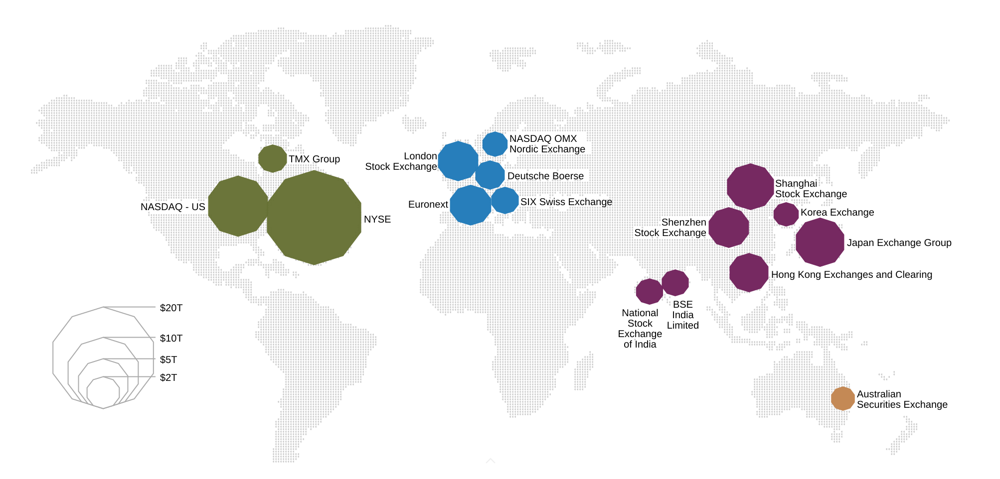
</div>

---

## Step 1: Understand the Problem and Establish Design Scope
 * C: Which securities are we going to trade? Stocks, options or futures?
 * I: Only stocks for simplicity
 * C: Which order types are supported - place, cancel, replace? What about limit, market, conditional orders?
 * I: We need to support placing and canceling an order. We need to only consider limit orders for the order type.
 * C: Does the system need to support after-hours trading?
 * I: No, just normal trading hours
 * C: Could you describe the exchange's basic functions?
 * I: Clients can place or cancel limit orders and receive matched trades in real-time. They should be able to see the order book in real time.
 * C: What's the scale of the exchange?
 * I: Tens of thousands of users trading at the same time and ~100 symbols. Billions of orders per day. We need to also support risk checks for compliance.
 * C: What kind of risk checks?
 * I: Let's do simple risk checks - e.g., limiting a user to trade only 1 million Apple shares in a day.
 * C: How about user wallet engagement?
 * I: We need to ensure clients have sufficient funds before placing orders. Funds meant for pending orders need to be withheld until order is finalized.

### **Non-functional requirements**
The scale mentioned by the interviewer hints that we are to design a small to medium scale exchange.
We need to also ensure flexibility to support more symbols and users in the future.

Other non-functional requirements:
 * Availability - At least 99.99%. Downtime can harm reputation
 * Fault tolerance - fault tolerance and a fast recovery mechanism are needed to limit the impact of a production incident
 * Latency - Round-trip latency should be at the millisecond level with a focus on the 99th percentile. Persistently high 99th-percentile latency causes a bad experience for a handful of users.
 * Security - We should have an account management system. For legal compliance, we need to support KYC to verify user identity. We should also protect against DDoS for public resources.

### **Back-of-the-envelope estimation**
 * 100 symbols, 1 billion orders per day
 * Normal trading hours are from 09:30 to 16:00 (6.5h)
 * QPS = 1 billion / 6.5 / 3,600 = 43,000
 * Peak QPS = 5 * QPS = 215000
 * Trading volume is significantly higher when the market opens

---

## Step 2: Propose High-Level Design and Get Buy-In

### **Business Knowledge 101**
Let's discuss some basic concepts related to an exchange.

A broker mediates interactions between an exchange and end users - Robinhood, Fidelity, etc.

Institutional clients trade in large quantities using specialized trading software. They need specialized treatment.
E.g., order splitting when trading in large volumes to avoid impacting the market.

Types of orders:
 * Limit - buy or sell at a fixed price. It might not find a match immediately or it might be partially matched.
 * Market - doesn't specify a price. Executed at the current market price immediately.

Prices:
 * Bid - highest price a buyer is willing to pay for a stock
 * Ask - lowest price at which a seller is willing to sell a stock

The US market has three tiers of price quotes - L1, L2, L3.

L1 market data contains best bid/ask prices and quantities:

<div style="margin-left:3rem">
    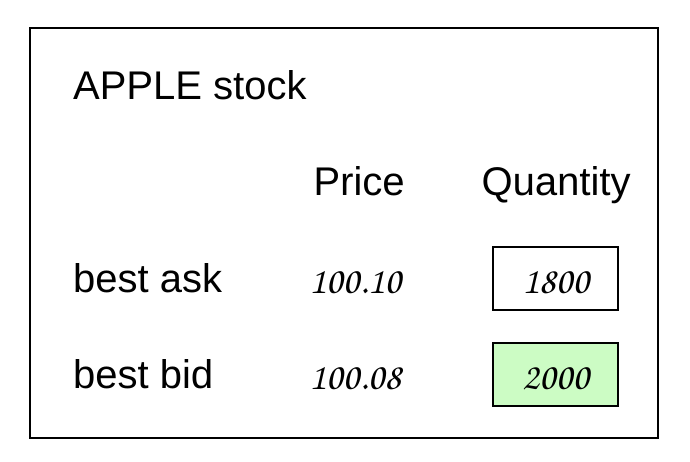
</div>

L2 includes more price levels:

<div style="margin-left:3rem">
    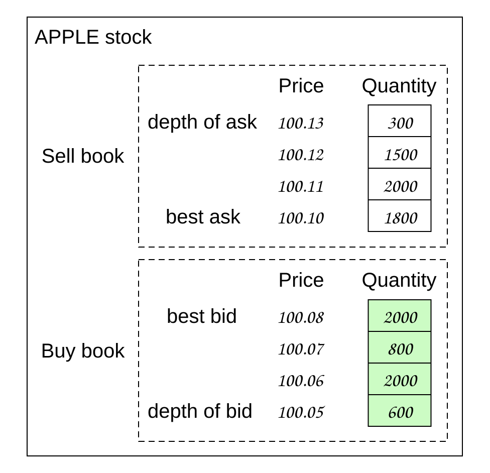
</div>

L3 shows levels and queued quantity at each level:

<div style="margin-left:3rem">
    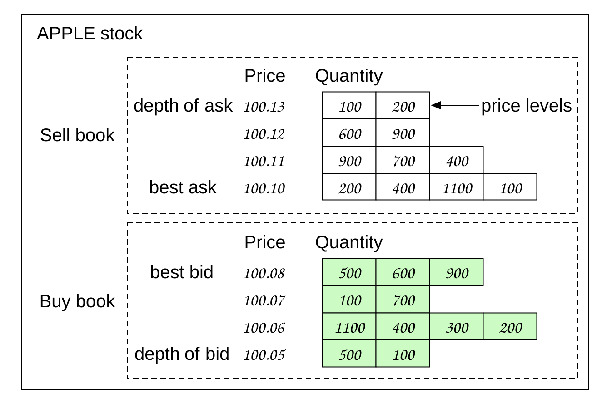
</div>

A candlestick shows the market's open and close prices, as well as the highest and lowest prices in the given interval:

<div style="margin-left:3rem">
    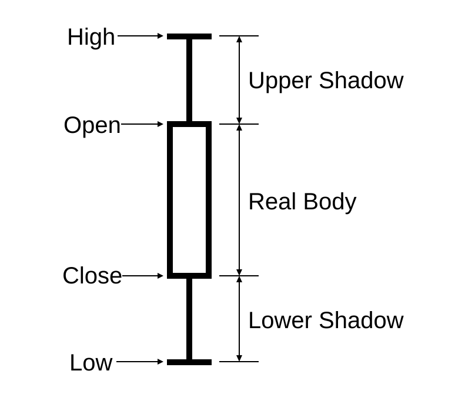
</div>

FIX is a protocol for exchanging securities transaction information, used by most vendors. Example securities transaction:
```text
8=FIX.4.2 | 9=176 | 35=8 | 49=PHLX | 56=PERS | 52=20071123-05:30:00.000 | 11=ATOMNOCCC9990900 | 20=3 | 150=E | 39=E | 55=MSFT | 167=CS | 54=1 | 38=15 | 40=2 | 44=15 | 58=PHLX EQUITY TESTING | 59=0 | 47=C | 32=0 | 31=0 | 151=15 | 14=0 | 6=0 | 10=128 |
```

### **High-level design**

<div style="margin-left:3rem">
    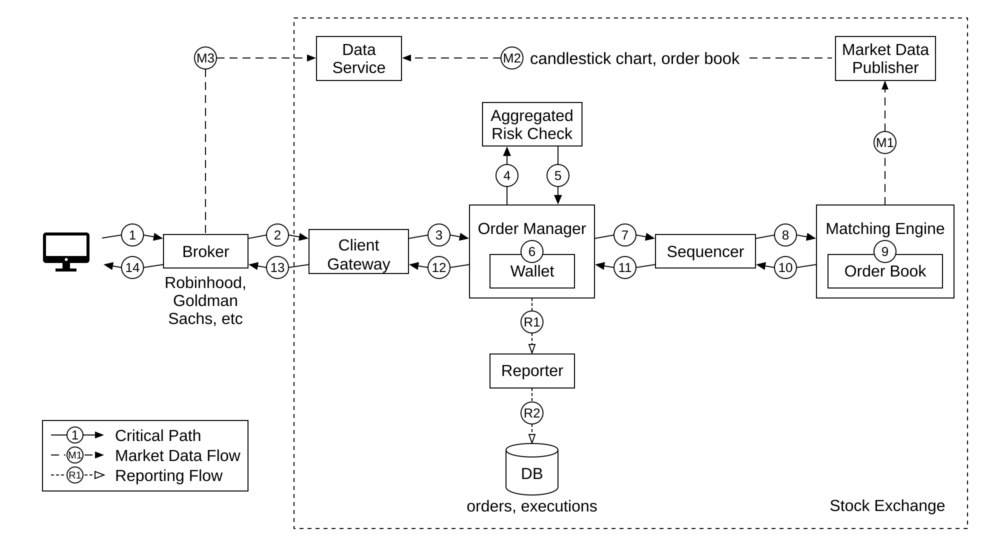
</div>

#### Trade flow:
* Step 1: A client places an order via the broker’s web or mobile app.
* Step 2: The broker sends the order to the exchange.
* Step 3: The order enters the exchange through the client gateway. The client gateway performs basic gatekeeping functions such as input validation, * rate limiting, authentication, normalization, etc. The client gateway then forwards the order to the order manager.
* Step 4 - 5: The order manager performs risk checks based on rules set by the risk manager.
* Step 6: After passing risk checks, the order manager verifies there are sufficient funds in the wallet for the order.
* Step 7 - 9: The order is sent to the matching engine. When a match is found, the matching engine emits two executions (also called fills), with one each for the buy and sell sides. To guarantee that matching results are deterministic when replay, both orders and executions are sequenced in the sequencer (more on the sequencer later).
* Step 10 - 14: The executions are returned to the client.

#### Market data flow (M1-M3):
* Step M1: The matching engine generates a stream of executions (fills) as matches are made. The stream is sent to the market data publisher.
* Step M2: The market data publisher constructs the candlestick charts and the order books from the stream of executions as market data.
* Step M3: The market data publisher sends the market data to the data service. The published market data is saved to specialized storage for real-time analytics. The brokers connect to the data service to obtain timely market data. Brokers relay market data to their clients.

#### Reporter flow (R1-R2):
 * The reporter collects all necessary reporting fields from orders and executions and writes them to the database.
 * reporting fields - client_id, price, quantity, order_type, filled_quantity, remaining_quantity

Trading flow is on the critical path, whereas the rest of the flows are not, hence, latency requirements differ between them.

#### Trading flow
The trading flow is on the critical path, hence, it should be highly optimized for low latency.

The matching engine is at its heart, also called the cross engine. Primary responsibilities:
 * Maintain the order book for each symbol - a list of buy/sell orders for a symbol.
 * Match buy and sell orders - a match results in two executions (fills), with one each for the buy and sell sides. This function must be fast and accurate
 * Distribute the execution stream as market data
 * Matches must be produced in a deterministic order. Foundational for high availability

Next is the sequencer - it is the key component making the matching engine deterministic by stamping each inbound order and outbound fill with a sequence ID.

<div style="margin-left:3rem">
    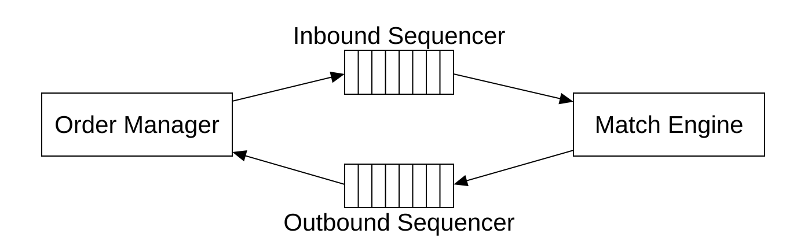
</div>

We stamp inbound orders and outbound fills for several reasons:
 * timeliness and fairness
 * fast recovery/replay
 * exactly-once guarantee

Conceptually, we could use Kafka as our sequencer since it's effectively an inbound and outbound message queue. However, we're going to implement it ourselves in order to achieve lower latency.

The order manager manages the orders state. It also interacts with the matching engine - sending orders and receiving fills.

The order manager's responsibilities:
 * Sends orders for risk checks - e.g., verifying that a user's trade volume is less than 1 million
 * Checks the order against the user wallet and verifies there are sufficient funds to execute it
 * It sends the order to the sequencer and on to the matching engine. To reduce bandwidth, only necessary order information is passed to the matching engine.
 * Executions (fills) are received back from the sequencer, where they are then sent to the brokers via the client gateway.

The main challenge with implementing the order manager is the state transition management. Event sourcing is one viable solution (discussed in deep dive).

Finally, the client gateway receives orders from users and sends them to the order manager. Its responsibilities:

<div style="margin-left:3rem">
    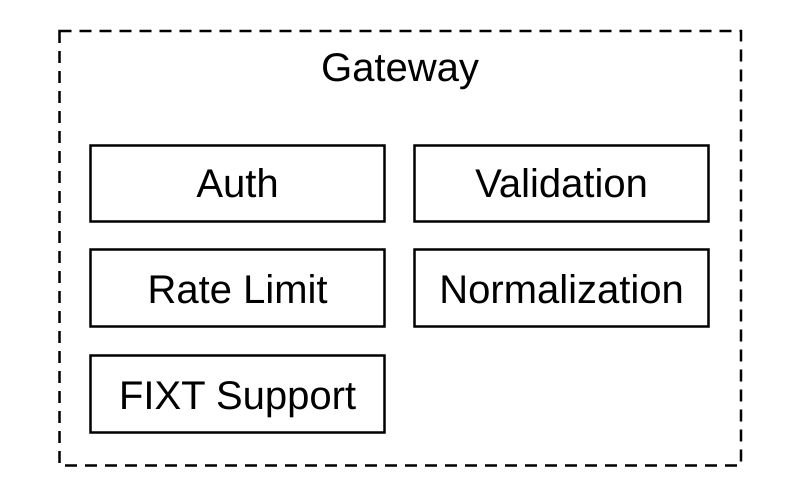
</div>

Since the client gateway is on the critical path, it should stay lightweight.

There can be multiple client gateways for different clients. For example, a colo engine is a trading engine server rented by the broker in the exchange's data center:

<div style="margin-left:3rem">
    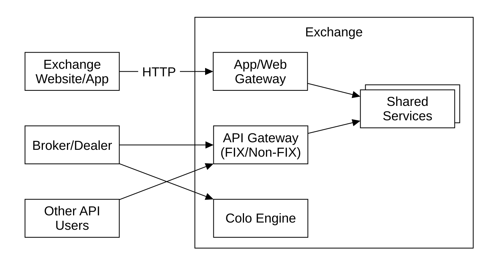
</div>

#### Market data flow
The market data publisher receives executions from the matching engine and builds the order book/candlestick charts from the execution stream.

That data is sent to the data service, which is responsible for showing the aggregated data to subscribers:

<div style="margin-left:3rem">
    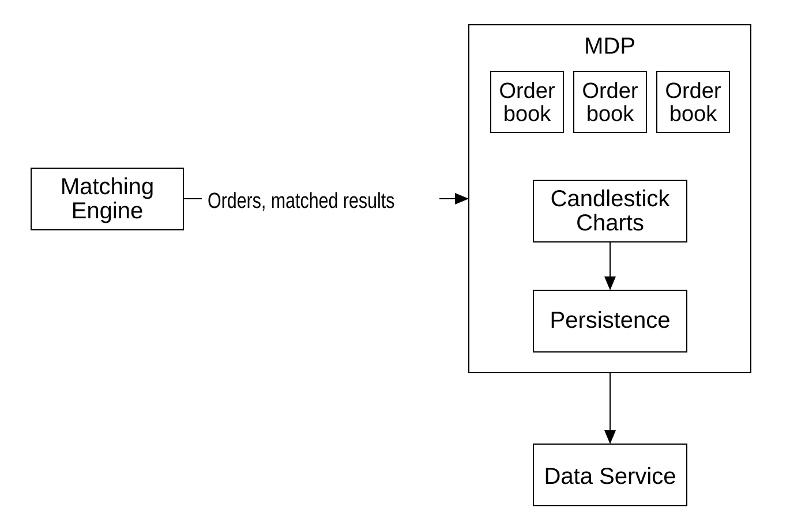
</div>

#### Reporting flow
The reporter is not on the critical path, but it is an important component nevertheless.

<div style="margin-left:3rem">
    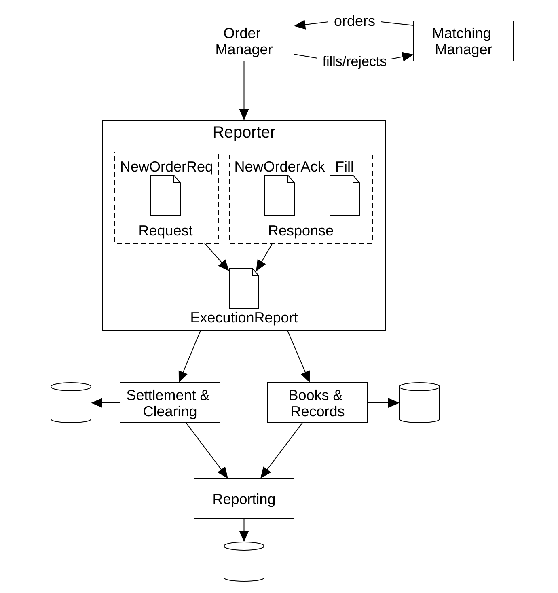
</div>

It is responsible for trading history, tax reporting, compliance reporting, settlements, etc.
Latency is not a critical requirement for the reporting flow. Accuracy and compliance are more important.

### **API Design**
Clients interact with the stock exchange via the brokers to place orders, view executions, market data, download historical data for analysis, etc.

We use a RESTful API for communication between the client gateway and the brokers.

For institutional clients, a proprietary protocol is used to satisfy their low-latency requirements.

Create order:
```http
POST /v1/order
```

Parameters:
 * symbol - the stock symbol. String
 * side - buy or sell. String
 * price - the price of the limit order. Long
 * orderType - limit or market (we only support limit orders in our design). String
 * quantity - the quantity of the order. Long

Response:
 * id - the ID of the order. Long
 * creationTime - the system creation time of the order. Long
 * filledQuantity - the quantity that has been successfully executed. Long
 * remainingQuantity - the quantity still to be executed. Long
 * status - new/canceled/filled. String
 * rest of the attributes are the same as the input parameters

Get execution:
```http
GET /execution?symbol={:symbol}&orderId={:orderId}&startTime={:startTime}&endTime={:endTime}
```

Parameters:
 * symbol - the stock symbol. String
 * orderId - the ID of the order. Optional. String
 * startTime - query start time in epoch \[11\]. Long
 * endTime - query end time in epoch. Long

Response:
 * executions - array with each execution in scope (see attributes below). Array
 * id - the ID of the execution. Long
 * orderId - the ID of the order. Long
 * symbol - the stock symbol. String
 * side - buy or sell. String
 * price - the price of the execution. Long
 * orderType - limit or market. String
 * quantity - the filled quantity. Long

Get order book:
```http
GET /marketdata/orderBook/L2?symbol={:symbol}&depth={:depth}
```

Parameters:
 * symbol - the stock symbol. String
 * depth - order book depth per side. Int

Response:
 * bids - array with price and size. Array
 * asks - array with price and size. Array

Get candlesticks:
```http
GET /marketdata/candles?symbol={:symbol}&resolution={:resolution}&startTime={:startTime}&endTime={:endTime}
```

Parameters:
 * symbol - the stock symbol. String
 * resolution - window length of the candlestick chart in seconds. Long
 * startTime - start time of the window in epoch. Long
 * endTime - end time of the window in epoch. Long

Response:
 * candles - array with each candlestick data (attributes listed below). Array
 * open - open price of each candlestick. Double
 * close - close price of each candlestick. Double
 * high - high price of each candlestick. Double
 * low - low price of each candlestick. Double

### **Data models**
There are three main types of data in our exchange:
 * Product, order, execution
 * order book
 * candlestick chart

#### Product, order, execution
Products describe the attributes of a traded symbol - product type, trading symbol, UI display symbol, etc.

This data doesn't change frequently, it is primarily used for rendering in a UI.

An order represents an instruction for a buy/sell order. Executions are outbound matched results.

Here's the data model:

<div style="margin-left:3rem">
    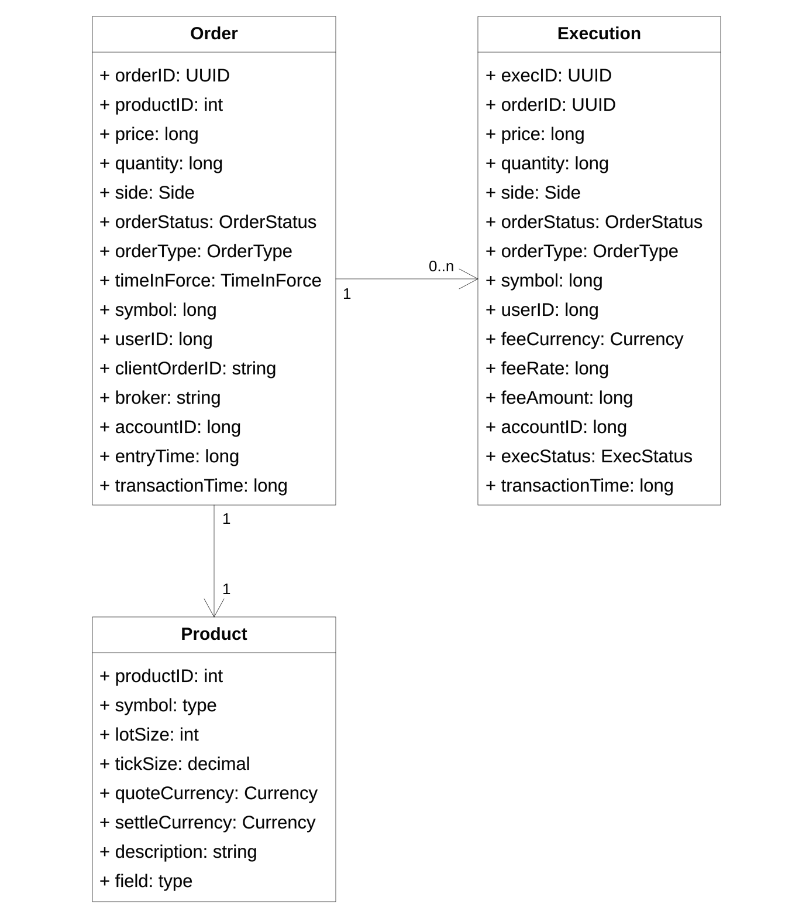
</div>

We encounter orders and executions in all of our three flows:
 * in the critical path, they are processed in-memory for high performance. They are stored and recovered from the sequencer.
 * The reporter writes orders and executions to the database for reporting use-cases
 * Executions are forwarded to market data to reconstruct the order book and candlestick chart

#### Order book
The order book is a list of buy/sell orders for an instrument, organized by price level.

An efficient data structure for this model needs to satisfy:
 * constant lookup time - getting volume at price level or between price levels
 * fast add/execute/cancel operations
 * query best bid/ask price
 * iterate through price levels

Example order book execution:

<div style="margin-left:3rem">
    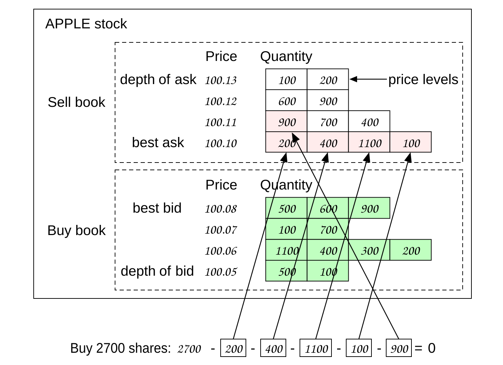
</div>

After fulfilling this large order, the price increases as the bid/ask spread widens.

Example order book implementation in Java-like pseudocode:
```java
class PriceLevel {
    private Price limitPrice;
    private long totalVolume;
    private List<Order> orders;
}

class Book<Side> {
    private Side side;
    private Map<Price, PriceLevel> limitMap;
}

class OrderBook {
    private Book<Buy> buyBook;
    private Book<Sell> sellBook;
    private PriceLevel bestBid;
    private PriceLevel bestOffer;
    private Map<OrderID, Order> orderMap;
}
```

For a more efficient implementation, we can use a doubly-linked list instead of a standard list:
 * Placing a new order is O(1), because we're adding an order to the tail of the list.
 * Matching an order is O(1), because we are deleting an order from the head
 * Canceling an order means deleting an order from the order book. We utilize `orderMap` for O(1) lookup and O(1) delete (due to the `Order` having a reference to the previous element in the list).

<div style="margin-left:3rem">
    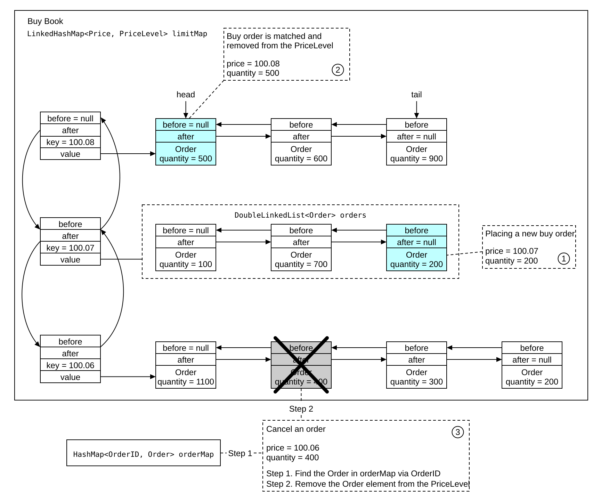
</div>

This data structure is also used in the market data services to reconstruct the order book.

#### Candlestick chart

The candlestick data is calculated within the market data services by processing orders in a time interval:
```java
class Candlestick {
    private long openPrice;
    private long closePrice;
    private long highPrice;
    private long lowPrice;
    private long volume;
    private long timestamp;
    private int interval;
}

class CandlestickChart {
    private LinkedList<Candlestick> sticks;
}
```

Some optimizations to avoid consuming too much memory:
 * Use pre-allocated ring buffers to hold sticks to reduce the allocation number
 * Limit the number of sticks in memory and persist the rest to disk

We'll use an in-memory columnar database (e.g., KDB) for real-time analytics. After the market closes, data is persisted in a historical database.

---

## Step 3: Design Deep Dive
One interesting thing to be aware of about modern exchanges is that unlike most other software, they typically run everything on one gigantic server.

Let's explore the details.

### **Performance**
For an exchange, it is very important to have good overall latency for all percentiles.

How can we reduce latency?
 * Reduce the number of tasks on the critical path
 * Shorten the time spent on each task by reducing network/disk usage and/or reducing task execution time

To achieve the first goal, we've stripped the critical path of all extraneous responsibilities; even logging is removed to achieve optimal latency.

If we follow the original design, there are several bottlenecks - network latency between services and disk usage of the sequencer.

With such a design, we can achieve tens of milliseconds of end-to-end latency. We want to achieve tens of microseconds instead.

Hence, we'll put everything on one server and processes are going to communicate via mmap as an event store:

<div style="margin-left:3rem">
    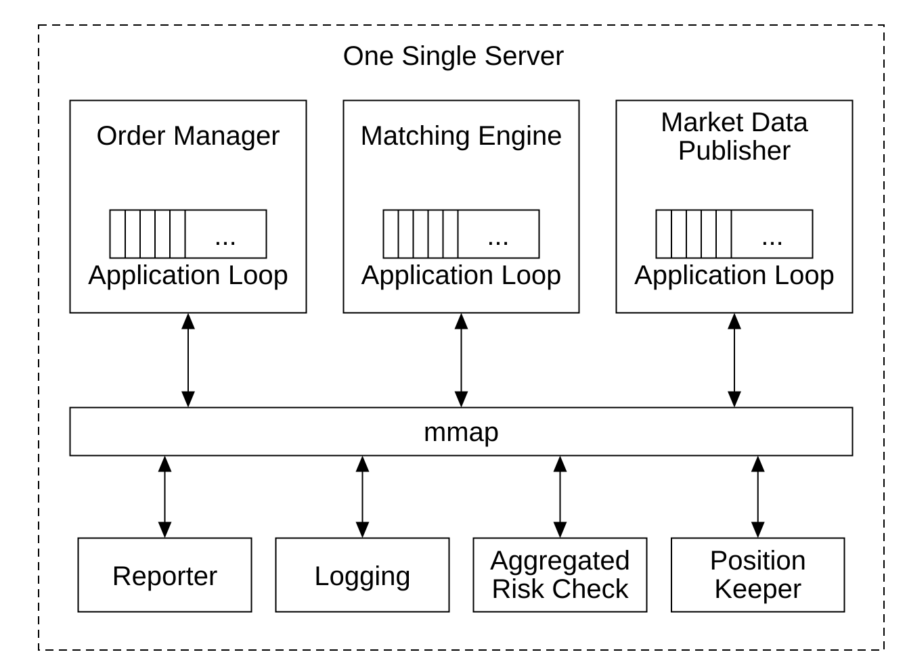
</div>

Another optimization is using an application loop (while loop executing mission-critical tasks), pinned to the same CPU to avoid context switching:

<div style="margin-left:3rem">
    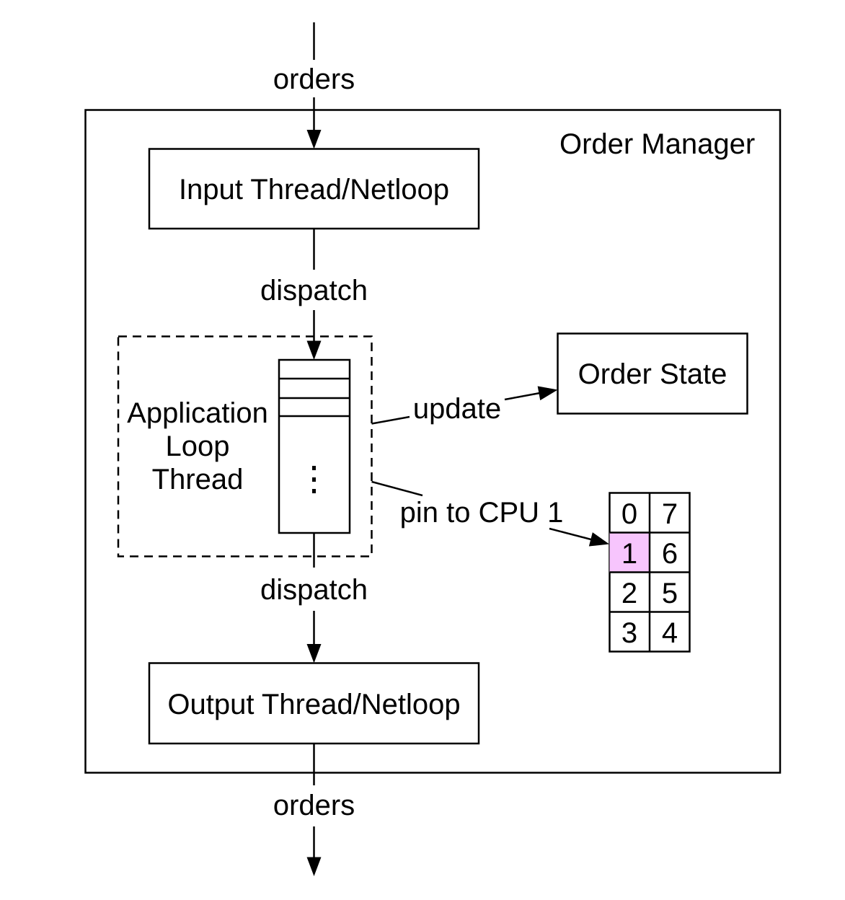
</div>

Another side effect of using an application loop is that there is no lock contention - multiple threads fighting for the same resource.

Let's now explore how mmap works - it is a UNIX syscall, which maps a file on disk to an application's memory.

One trick we can use is creating the file in `/dev/shm`, which stands for "shared memory". Hence, we have no disk access at all.

### **Event sourcing**
Event sourcing is discussed in depth in the [digital wallet chapter](../27.%20Digital%20Wallet/Readme.md). Reference it for all the details.

In a nutshell, instead of storing current states, we store immutable state transitions:

<div style="margin-left:3rem">
    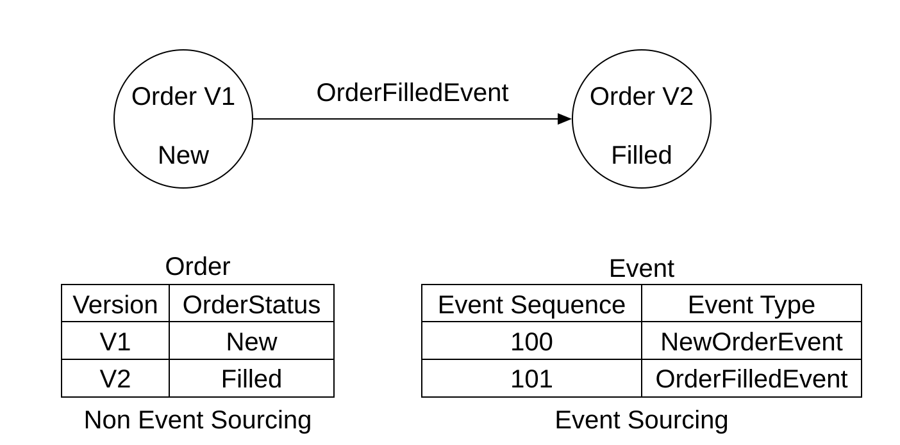
</div>

 * On the left - traditional schema
 * On the right - event source schema

Here's how our design looks like thus far:

<div style="margin-left:3rem">
    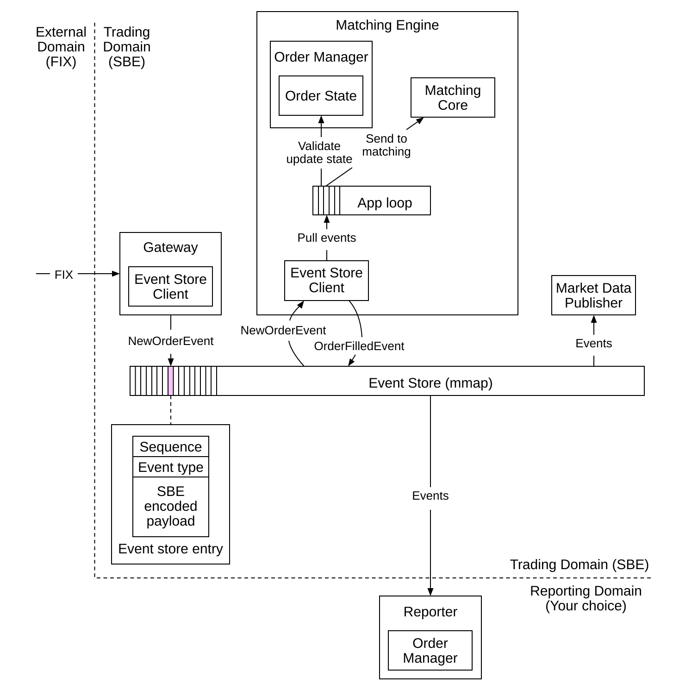
</div>

 * external domain interacts with our client gateway using the FIX protocol
 * Order manager receives the new order event, validates it and adds it to its internal state. Order is then sent to matching core
 * If order is matched, the `OrderFilledEvent` is generated and sent over mmap
 * Other components subscribe to the event store and do their part of the processing

One additional optimization is that all components hold a copy of the order manager, which is packaged as a library to avoid extra calls for managing orders.

The sequencer in this design changes from being an event store to being a single writer that sequences events before forwarding them to the event store:

<div style="margin-left:3rem">
    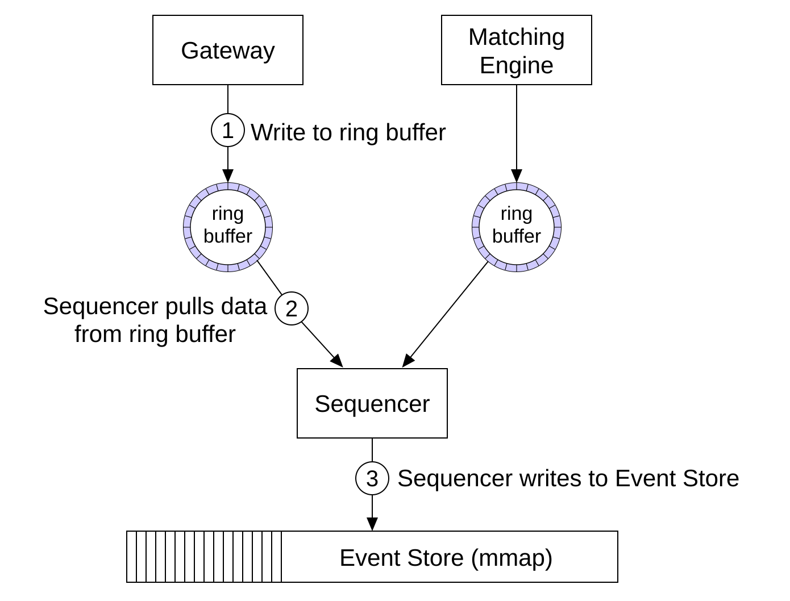
</div>

### **High availability**
We aim for 99.99% availability - only 8.64s of downtime per day.

To achieve that, we have to identify single-point-of-failures in the exchange architecture:
 * Set up backup instances of critical services (e.g., the matching engine) that are on standby.
 * aggressively automate failure detection and failover to the backup instance

Stateless services such as the client gateway can easily be horizontally scaled by adding more servers.

For stateful components, we can process inbound events, but not publish outbound events if we're not the leader:

<div style="margin-left:3rem">
    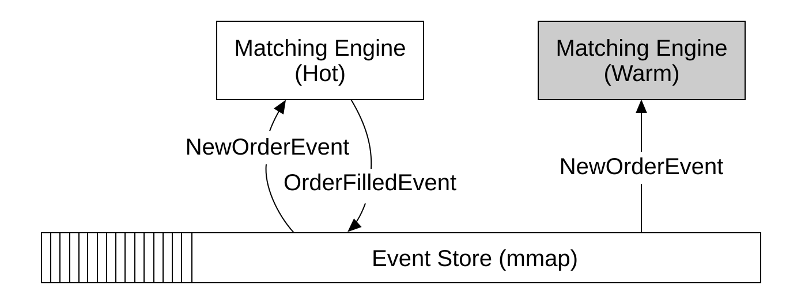
</div>

To detect whether the primary replica is down, we can send heartbeats to detect that it's nonfunctional.

This mechanism only works within the boundary of a single server.
If we want to extend it, we can set up an entire server as a hot/warm replica and fail over in case of failure.

To replicate the event store across the replicas, we can use reliable UDP for faster communication.

### **Fault tolerance**
What if even the warm instances go down? It is a low probability event but we should be ready for it.

Large tech companies tackle this problem by replicating core data to data centers in multiple cities to mitigate risks such as natural disasters.

Questions to consider:
 * If the primary instance is down, how and when do we fail over to the backup instance?
 * How do we choose the leader among the backup instances?
 * What is the recovery time needed (RTO - recovery time objective)?
 * What functionalities need to be recovered? Can our system operate under degraded conditions?

How to address these:
 * System can be down due to a bug (affecting primary and replicas), we can use chaos engineering to surface edge-cases and disastrous outcomes like these
 * Initially though, we could perform failovers manually until we gather sufficient knowledge about the system's failure modes
 * Leader election can be used (e.g., Raft) to determine which replica becomes the leader if the primary goes down.

Example of how replication works across different servers:

<div style="margin-left:3rem">
    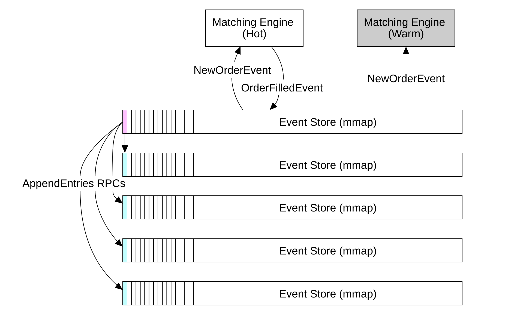
</div>

Example leader-election terms:

<div style="margin-left:3rem">
    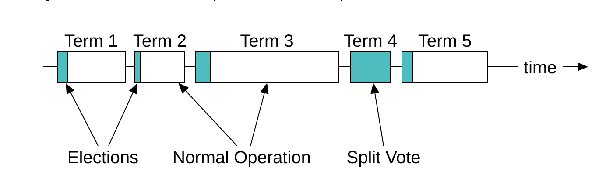
</div>

For details on how Raft works, [check this out](https://thesecretlivesofdata.com/raft/)

Finally, we need to also consider loss tolerance - how much data can we lose before things get critical?
This will determine how often we back up our data.

For a stock exchange, data loss is unacceptable, so we have to backup data often and rely on raft's replication to reduce probability of data loss.

### **Matching algorithms**
Slight detour on how matching works via pseudocode:

```java
Context handleOrder(OrderBook orderBook, OrderEvent orderEvent) {
    if (orderEvent.getSequenceId() != nextSequence) {
        return Error(OUT_OF_ORDER, nextSequence);
    }

    if (!validateOrder(symbol, price, quantity)) {
        return ERROR(INVALID_ORDER, orderEvent);
    }

    Order order = createOrderFromEvent(orderEvent);
    switch (msgType):
        case NEW:
            return handleNew(orderBook, order);
        case CANCEL:
            return handleCancel(orderBook, order);
        default:
            return ERROR(INVALID_MSG_TYPE, msgType);

}

Context handleNew(OrderBook orderBook, Order order) {
    if (BUY.equals(order.side)) {
        return match(orderBook.sellBook, order);
    } else {
        return match(orderBook.buyBook, order);
    }
}

Context handleCancel(OrderBook orderBook, Order order) {
    if (!orderBook.orderMap.contains(order.orderId)) {
        return ERROR(CANNOT_CANCEL_ALREADY_MATCHED, order);
    }

    removeOrder(order);
    setOrderStatus(order, CANCELED);
    return SUCCESS(CANCEL_SUCCESS, order);
}

Context match(OrderBook book, Order order) {
    Quantity leavesQuantity = order.quantity - order.matchedQuantity;
    Iterator<Order> limitIter = book.limitMap.get(order.price).orders;
    while (limitIter.hasNext() && leavesQuantity > 0) {
        Quantity matched = min(limitIter.next.quantity, order.quantity);
        order.matchedQuantity += matched;
        leavesQuantity = order.quantity - order.matchedQuantity;
        remove(limitIter.next);
        generateMatchedFill();
    }
    return SUCCESS(MATCH_SUCCESS, order);
}
```

This matching algorithm uses the FIFO algorithm for determining which orders at a price level to match.

### **Determinism**
Functional determinism is guaranteed via the sequencer technique we used.

The actual time when the event happens doesn't matter:

<div style="margin-left:3rem">
    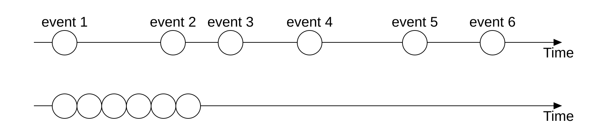
</div>

Latency determinism is something we have to track. We can calculate it by monitoring 99th- or 99.99th-percentile latency.

Things that can cause latency spikes include garbage collector events in, e.g., Java.

### **Market data publisher optimizations**
The market data publisher receives matched results from the matching engine and rebuilds the order book and candlestick charts based on them.

We only keep some of the candlesticks, as we don't have infinite memory. Clients can choose how much granularity they want. More granular information might require a higher price:

<div style="margin-left:3rem">
    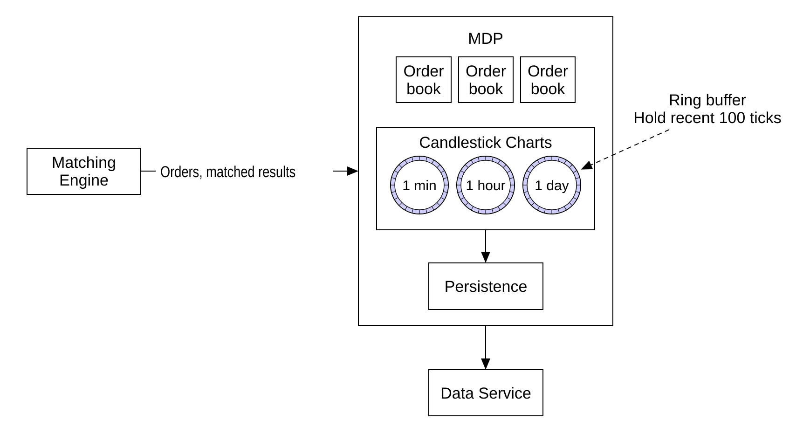
</div>

A ring buffer (aka circular buffer) is a fixed-size queue with the head connected to the tail. The space is preallocated to avoid allocations. The data structure is also lock-free.

Another technique to optimize the ring buffer is padding, which ensures the sequence number is never in a cache line with anything else.

### **Distribution fairness of market data and multicast**
We need to ensure subscribers receive the data at the same time since if one receives data before another, that gives them crucial market insight, which they can use to manipulate the market.

To achieve this, we can use multicast using reliable UDP when publishing data to subscribers.

Data can be transported via the internet in three ways:
 * Unicast - one source, one destination
 * Broadcast - one source to entire subnetwork
 * Multicast - one source to a set of hosts on different subnetworks

In theory, by using multicast, all subscribers should receive the data at the same time.

UDP, however, is unreliable and the data might not reach everyone. It can be enhanced with retransmissions, however.

### **Colocation**
Exchanges offer brokers the ability to colocate their servers in the same data center as the exchange.

This reduces the latency drastically and can be considered a VIP service.

### **Network Security**
DDoS is a challenge for exchanges, as there are some internet-facing services. Here are our options:
 * Isolate public services and data from private services, so DDoS attacks don't impact the most important clients
 * Use a caching layer to store data which is infrequently updated
 * Harden URLs against DDoS; e.g., prefer `https://my.website.com/data/recent` over `https://my.website.com/data?from=123&to=456` because the former is more cacheable.
 * Effective allowlist/blocklist mechanism is needed.
 * Rate limiting can be used to mitigate DDoS

---

## Step 4: Wrap Up
Other interesting notes:
 * Not all exchanges rely on putting everything on one big server, but some still do.
 * Modern exchanges rely more on cloud infrastructure and also on automatic market makers (AMM) to avoid maintaining an order book.
