# Chapter 28: Stock Exchange
<sub>[Back to System Design](../Readme.md#content)</sub>

## Introduction
We'll design an **electronic stock exchange** in this chapter.

Its basic function is to efficiently match buyers and sellers.

Major stock exchanges include **NYSE** and **NASDAQ**, among others.

<div style="margin-left:3rem">
    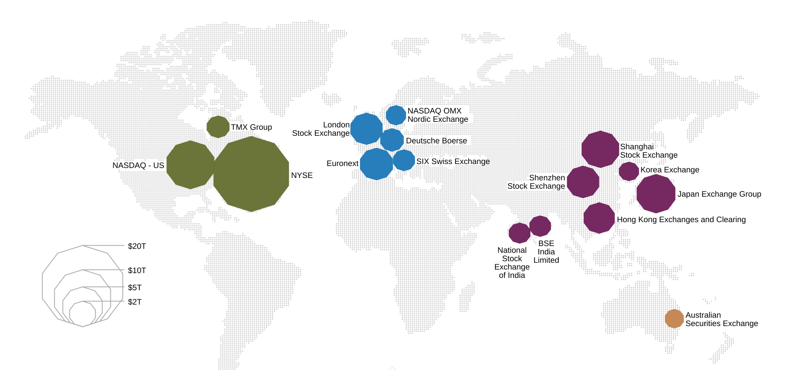
</div>

## Step 1: Understand the Problem and Establish Design Scope
* C: Which securities are we going to trade? Stocks, options or futures?
* I: Only stocks for simplicity
* C: Which order types are supported - place, cancel, replace? What about limit, market, conditional orders?
* I: We need to support placing and canceling an order. We need to only consider limit orders for the order type.
* C: Does the system need to support after-hours trading?
* I: No, just normal trading hours
* C: Could you describe the exchange's basic functions?
* I: Clients can place or cancel limit orders and receive matched trades in real time. They should be able to see the order book in real time.
* C: What's the scale of the exchange?
* I: Tens of thousands of users trading at the same time and ~100 symbols. Billions of orders per day. We need to also support risk checks for compliance.
* C: What kind of risk checks?
* I: Let's do simple risk checks - e.g., limiting a user to trading only 1 million Apple shares in a day.
* C: How about user wallet engagement?
* I: We need to ensure clients have sufficient funds before placing orders. Funds meant for pending orders need to be withheld until the order is finalized.

### **Non-functional requirements**

The scale mentioned by the interviewer hints that we are to design a small- to medium-scale exchange.

We need to also ensure flexibility to support more symbols and users in the future.

Other non-functional requirements:
* Availability - At least 99.99%. Downtime can harm reputation
* Fault tolerance - fault tolerance and a fast recovery mechanism are needed to limit the impact of a production incident
* Latency - Round-trip latency should be at the millisecond level with a focus on the 99th percentile. Persistently high 99th-percentile latency causes a bad experience for a handful of users.
* Security - We should have an account management system. For legal compliance, we need to support KYC to verify user identity. We should also protect against DDoS for public resources.

### **Back-of-the-envelope estimation**
* 100 symbols, 1 billion orders per day
* Normal trading hours are from 09:30 to 16:00 (6.5h)
* QPS = 1 billion / 6.5 / 3,600 = 43,000
* Peak QPS = 5 * QPS = 215000
* Trading volume is significantly higher when the market opens

## Step 2: Propose High-Level Design and Get Buy-In

### **Business Knowledge 101**
Let's discuss some basic concepts related to an exchange.

A broker mediates interactions between an exchange and end users - Robinhood, Fidelity, etc.

Institutional clients trade in large quantities using specialized trading software. They need specialized treatment.
E.g., order splitting when trading in large volumes to avoid impacting the market.

Types of orders:
* Limit - buy or sell at a fixed price. It might not find a match immediately or it might be partially matched.
* Market - doesn't specify a price. Executed at the current market price immediately.

Prices:
* Bid - highest price a buyer is willing to pay for a stock
* Ask - lowest price at which a seller is willing to sell a stock

#### **Market data levels**

The US stock market has three tiers of price quotes: L1 (level 1), L2, and L3. L1 market data contains the best bid price, ask price, and quantities (the image below). Bid price refers to the highest price a buyer is willing to pay for a stock. Ask price refers to the lowest price at which a seller is willing to sell the stock.

L1 market data contains the best bid/ask prices and quantities:

<div style="margin-left:3rem">
    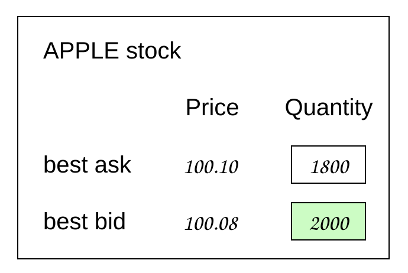
</div>

L2 includes more price levels:

<div style="margin-left:3rem">
    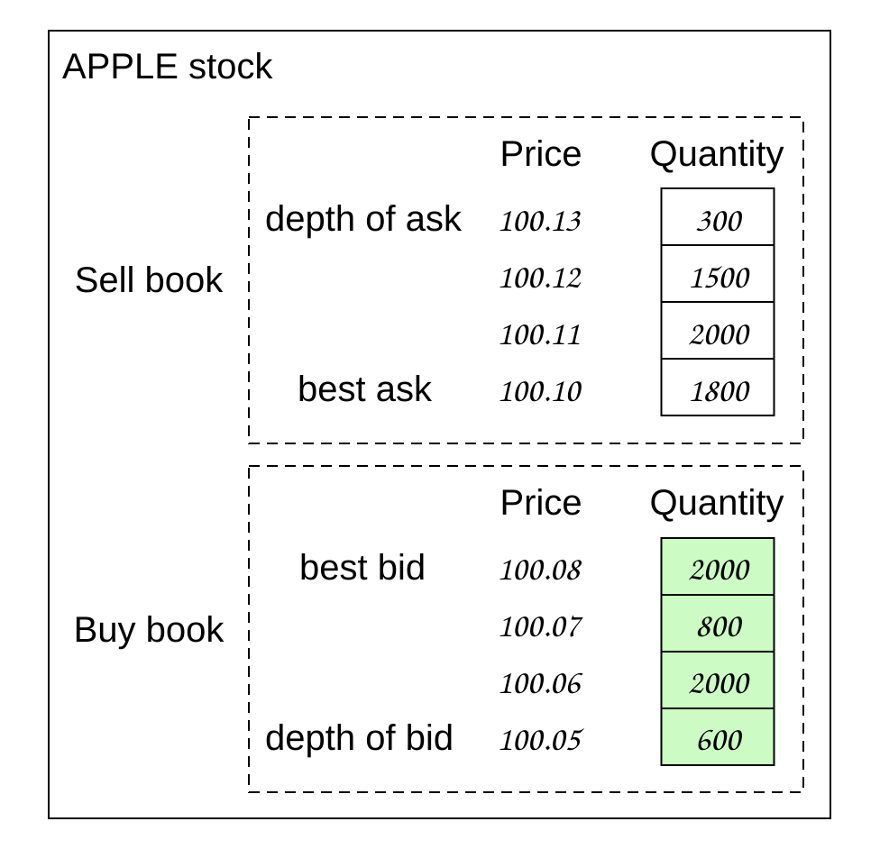
</div>

L3 shows levels and queued quantity at each level:

<div style="margin-left:3rem">
    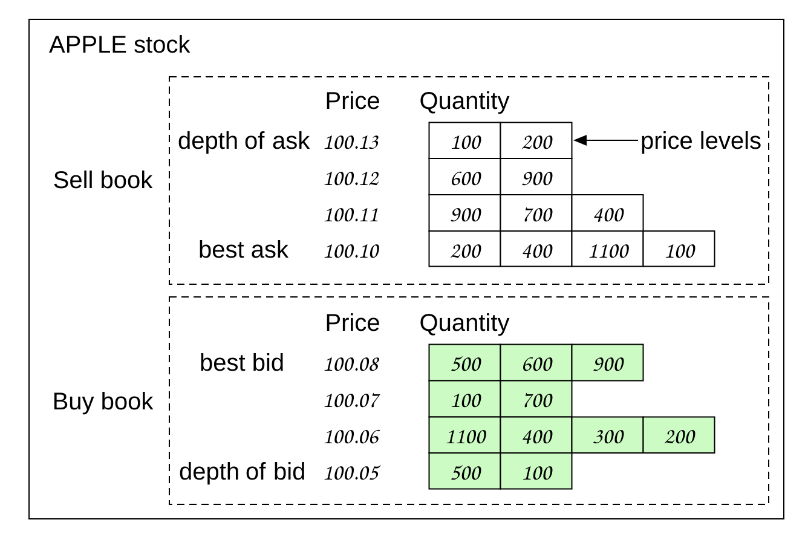
</div>

#### **Candlestick chart**

A candlestick chart represents the stock price for a certain period of time. A typical candlestick looks like this (the image below). A candlestick shows the market’s open, close, high, and low prices for a time interval. The common time intervals are one minute, five minutes, one hour, one day, one week, and one month.

<div style="margin-left:3rem">
    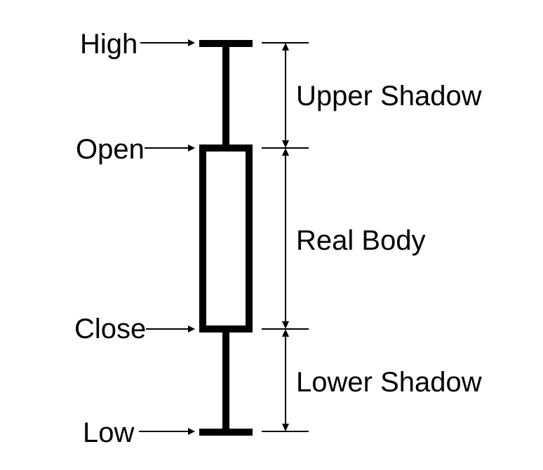
</div>

#### **FIX**

The FIX protocol, which stands for Financial Information eXchange protocol, was created in 1991. It is a vendor-neutral communications protocol for exchanging securities transaction information. See below for an example of a securities transaction encoded in FIX.

FIX is a protocol for exchanging securities transaction information, used by most vendors. Example securities transaction:
```text
8=FIX.4.2 | 9=176 | 35=8 | 49=PHLX | 56=PERS |
52=20071123-05:30:00.000 | 11=ATOMNOCCC9990900 |
20=3 | 150=E | 39=E | 55=MSFT | 167=CS | 54=1 |
38=15 | 40=2 | 44=15 | 58=PHLX EQUITY TESTING |
59=0 | 47=C | 32=0 | 31=0 | 151=15 | 14=0 | 6=0 | 10=128 |
```

### **High-level design**

<div style="margin-left:3rem">
    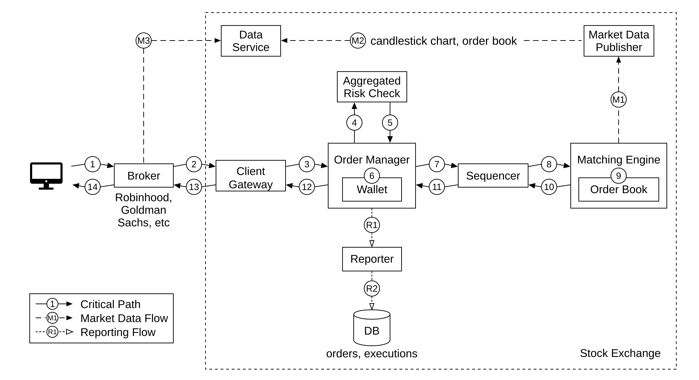
</div>

#### **Trading flow**:
* Step 1: A client places an order via the broker’s web or mobile app.
* Step 2: The broker sends the order to the exchange.
* Step 3: The order enters the exchange through the client gateway. The client gateway performs basic gatekeeping functions such as input validation, rate limiting, authentication, normalization, etc. The client gateway then forwards the order to the order manager.
* Steps 4 - 5: The order manager performs risk checks based on rules set by the risk manager.
* Step 6: After passing risk checks, the order manager verifies there are sufficient funds in the wallet for the order.
* Steps 7 - 9: The order is sent to the matching engine. When a match is found, the matching engine emits two executions (also called fills), with one each for the buy and sell sides. To guarantee that matching results are deterministic when replayed, both orders and executions are sequenced in the sequencer (more on the sequencer later).
* Steps 10 - 14: The executions are returned to the client.

#### **Market data flow (M1-M3)**:
* Step M1: The matching engine generates a stream of executions (fills) as matches are made. The stream is sent to the market data publisher.
* Step M2: The market data publisher constructs the candlestick charts and the order books from the stream of executions as market data.
* Step M3: The market data publisher sends the market data to the data service. The published market data is saved to specialized storage for real-time analytics. The brokers connect to the data service to obtain timely market data. Brokers relay market data to their clients.

#### **Reporter flow (R1-R2)**:
* The reporter collects all necessary reporting fields from orders and executions and writes them to the database.
* Reporting fields - `client_id`, `price`, `quantity`, `order_type`, `filled_quantity`, `remaining_quantity`.

The trading flow is on the critical path, whereas the rest of the flows are not; hence, latency requirements differ between them.

#### **Trading flow**
The trading flow is on the critical path; hence, it should be highly optimized for low latency.

#### **Matching engine**

The **matching engine** is at its heart, also called the cross engine. Primary responsibilities:
1. Maintain the order book for each symbol. An order book is a list of buy and sell orders for a symbol.
2. Match buy and sell orders. A match results in two executions (fills), with one each for the buy and sell sides. This function must be fast and accurate.
3. Distribute the execution stream as market data

Matches must be produced in a deterministic order. This is foundational for high availability.

#### **Sequencer**

Next is the **sequencer** - it is the key component making the matching engine deterministic by stamping each inbound order and outbound fill with a sequence ID.

<div style="margin-left:3rem">
    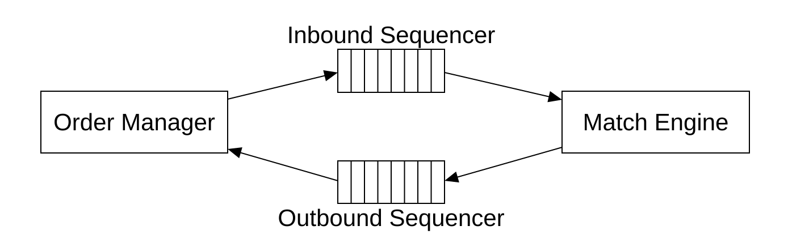
</div>

We stamp inbound orders and outbound fills for several reasons:
1. Timeliness and fairness
2. Fast recovery/replay
3. Exactly-once guarantee

Conceptually, we could use Kafka as our sequencer since it's effectively an inbound and outbound message queue. However, we're going to implement it ourselves in order to achieve lower latency.

#### **Order manager**

The **order manager** manages the order state. It also interacts with the matching engine - sending orders and receiving fills.

The order manager's responsibilities:
* Sends orders for risk checks - e.g., verifying that a user's trade volume is less than 1 million
* Checks the order against the user wallet and verifies there are sufficient funds to execute it
* It sends the order to the sequencer and on to the matching engine. To reduce bandwidth, only necessary order information is passed to the matching engine.
* Executions (fills) are received back from the sequencer, where they are then sent to the brokers via the client gateway.

The main challenge with implementing the order manager is the state transition management. Event sourcing is one viable solution (discussed in the deep dive).

#### **Client gateway**

Finally, the **client gateway** receives orders from users and sends them to the order manager. Its responsibilities:

<div style="margin-left:3rem">
    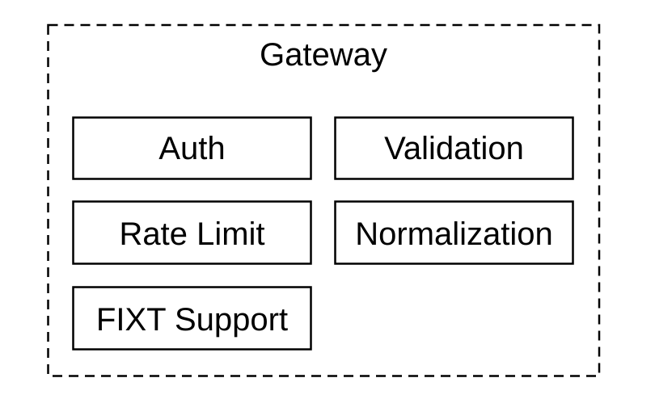
</div>

Since the client gateway is on the critical path, it should stay lightweight.

There can be multiple client gateways for different clients. For example, a Colo Engine is a trading engine server rented by the broker in the exchange's data center. The latency is literally the time it takes for light to travel from the colocated server to the exchange server [[10]](#ref-10):

<div style="margin-left:3rem">
    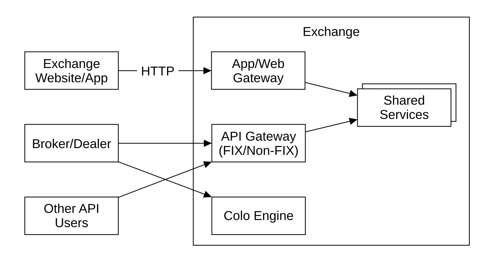
</div>

#### **Market data flow**

The **market data publisher (MDP)** receives executions (fills) from the matching engine and builds the order book/candlestick charts from the execution stream.

That data is sent to the data service, which is responsible for showing the aggregated data to subscribers:

<div style="margin-left:3rem">
    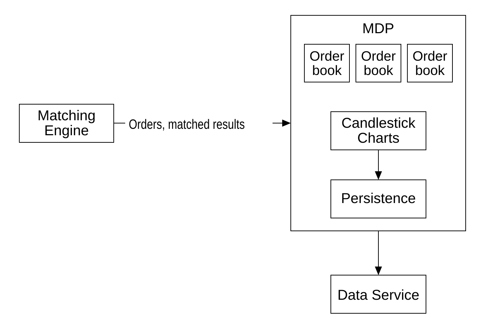
</div>

#### **Reporting flow**
The reporter is not on the critical path, but it is an important component nevertheless.

<div style="margin-left:3rem">
    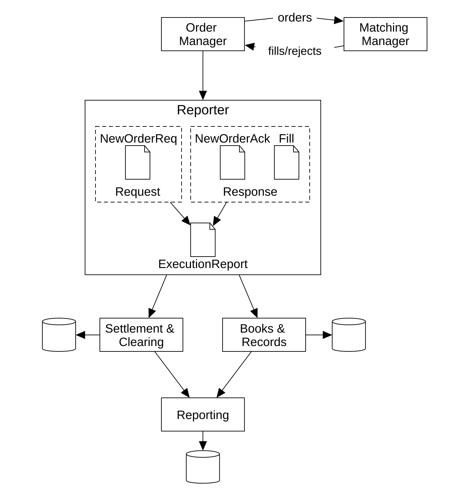
</div>

It is responsible for trading history, tax reporting, compliance reporting, settlements, etc.
Latency is not a critical requirement for the reporting flow. Accuracy and compliance are more important.

### **API Design**
Clients interact with the stock exchange via the brokers to place orders, view executions and market data, download historical data for analysis, etc.

We use a RESTful API for communication between the client gateway and the brokers.

For institutional clients, a proprietary protocol is used to satisfy their low-latency requirements.

#### **Order**:
```http
POST /v1/order
```

Parameters:
* symbol - the stock symbol. String
* side - buy or sell. String
* price - the price of the limit order. Long
* orderType - limit or market (we only support limit orders in our design). String
* quantity - the quantity of the order. Long

Response:
* id - the ID of the order. Long
* creationTime - the system creation time of the order. Long
* filledQuantity - the quantity that has been successfully executed. Long
* remainingQuantity - the quantity still to be executed. Long
* status - new/canceled/filled. String
* The rest of the attributes are the same as the input parameters

#### **Execution**:
```http
GET /execution?symbol={:symbol}&orderId={:orderId}&startTime={:startTime}&endTime={:endTime}
```

Parameters:
* symbol - the stock symbol. String
* orderId - the ID of the order. Optional. String
* startTime - query start time in epoch [[11]](#ref-11). Long
* endTime - query end time in epoch. Long

Response:
* executions - array with each execution in scope (see attributes below). Array
* id - the ID of the execution. Long
* orderId - the ID of the order. Long
* symbol - the stock symbol. String
* side - buy or sell. String
* price - the price of the execution. Long
* orderType - limit or market. String
* quantity - the filled quantity. Long

#### **Order book**:
```http
GET /marketdata/orderBook/L2?symbol={:symbol}&depth={:depth}
```

Parameters:
* symbol - the stock symbol. String
* depth - order book depth per side. Int

Response:
* bids - array with price and size. Array
* asks - array with price and size. Array

#### **Candlestick charts**:
```http
GET /marketdata/candles?symbol={:symbol}&resolution={:resolution}&startTime={:startTime}&endTime={:endTime}
```

Parameters:
* symbol - the stock symbol. String
* resolution - window length of the candlestick chart in seconds. Long
* startTime - start time of the window in epoch. Long
* endTime - end time of the window in epoch. Long

Response:
* candles - array with each candlestick’s data (attributes listed below). Array
* open - open price of each candlestick. Double
* close - close price of each candlestick. Double
* high - high price of each candlestick. Double
* low - low price of each candlestick. Double

### **Data models**
There are three main types of data in our exchange:
* Product, order, execution
* Order book
* Candlestick chart

#### **Product, order, execution**
Products describe the attributes of a traded symbol - product type, trading symbol, UI display symbol, etc.

This data doesn't change frequently; it is primarily used for rendering in a UI.

An order represents an instruction for a buy/sell order. Executions are outbound matched results.

Here's the data model:

<div style="margin-left:3rem">
    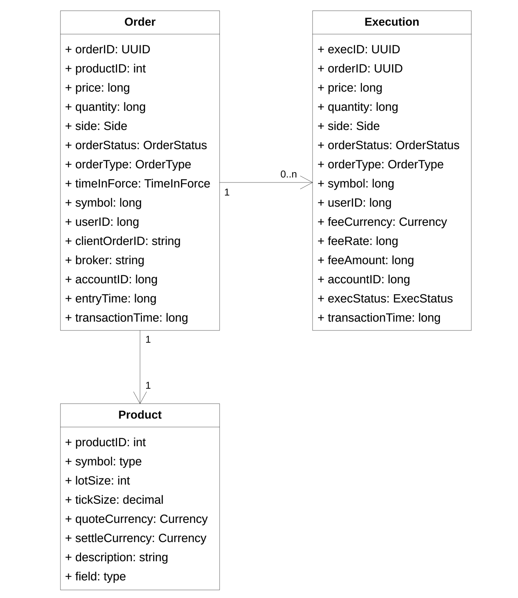
</div>

We encounter orders and executions in all of our three flows:
* On the critical path, they are processed in memory for high performance. They are stored and recovered from the sequencer.
* The reporter writes orders and executions to the database for reporting use cases
* Executions are forwarded to market data to reconstruct the order book and candlestick chart

#### **Order book**
The order book is a list of buy/sell orders for an instrument, organized by price level [[12]](#ref-12) [[13]](#ref-13).

An efficient data structure for this model needs to satisfy these requirements:
* Constant lookup time - getting volume at a price level or between price levels.
* Fast add/execute/cancel operations, preferably with O(1) time complexity.
* Fast update. Operation: replacing an order.
* Query best bid/ask price.
* Iterate through price levels.

Example order book execution:

<div style="margin-left:3rem">
    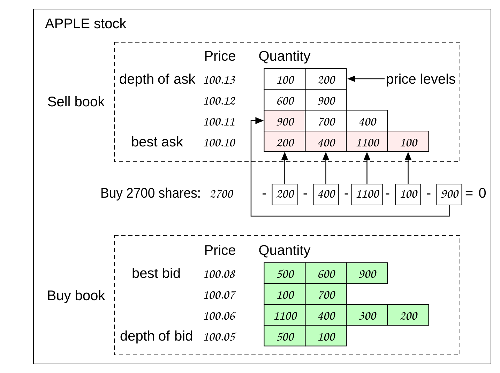
</div>

In the example above, there is a large market buy order for 2700 shares of Apple. The buy order matches all the market sell orders in the best ask queue and the first sell order in the 100.11 price queue. After fulfilling this large order, the price increases as the bid/ask spread widens.

Example order book implementation in Java-like pseudocode:

```java
class PriceLevel {
    private Price limitPrice;
    private long totalVolume;
    private List<Order> orders;
}

class Book<Side> {
    private Side side;
    private Map<Price, PriceLevel> limitMap;
}

class OrderBook {
    private Book<Buy> buyBook;
    private Book<Sell> sellBook;
    private PriceLevel bestBid;
    private PriceLevel bestOffer;
    private Map<OrderID, Order> orderMap;
}
```

For a more efficient implementation, we can use a doubly linked list instead of a standard list:
1. Placing a new order means adding a new `Order` to the tail of the `PriceLevel`. This has O(1) time complexity for a doubly linked list.
2. Matching an order means deleting an `Order` from the head of the `PriceLevel`. This has O(1) time complexity for a doubly linked list.
3. Canceling an order means deleting an `Order` from the `OrderBook`. We utilize `Map<OrderID, Order> orderMap` in `OrderBook` to find the `Order` to be canceled, and to remove it from `PriceLevel`. This deletion operation has O(1) time complexity for doubly linked lists.

The image below explains how those three operations work.

<div style="margin-left:3rem">
    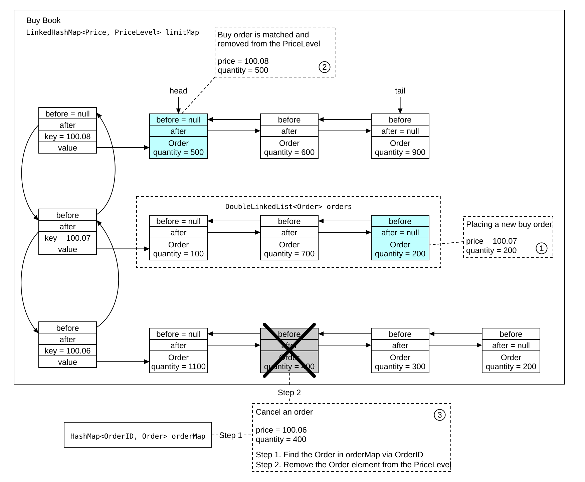
</div>

This data structure is also used in the market data services to reconstruct the order book.

#### **Candlestick chart**

The candlestick data is calculated within the market data services by processing orders in a time interval:

```java
class Candlestick {
    private long openPrice;
    private long closePrice;
    private long highPrice;
    private long lowPrice;
    private long volume;
    private long timestamp;
    private int interval;
}

class CandlestickChart {
    private LinkedList<Candlestick> sticks;
}
```

Some optimizations to avoid consuming too much memory:
1. Use pre-allocated ring buffers to hold sticks to reduce the number of allocations
2. Limit the number of sticks in memory and persist the rest to disk

We'll use an in-memory columnar database (e.g., KDB [[15]](#ref-15)) for real-time analytics. After the market closes, data is persisted in a historical database.

## Step 3: Design Deep Dive

One interesting thing to be aware of about modern exchanges is that unlike most other software, they typically run everything on one gigantic server.

Let's explore the details.

### **Performance**

For an exchange, it is very important to have good overall latency for all percentiles.

How can we reduce latency?
* Reduce the number of tasks on the critical path
* Shorten the time spent on each task by reducing network/disk usage and/or reducing task execution time

To achieve the first goal, we've stripped the critical path of all extraneous responsibilities; even logging is removed to achieve optimal latency.

`gateway` → `order manager` → `sequencer` → `matching engine`

If we follow the original design, there are several bottlenecks - network latency between services and disk usage of the sequencer.

We can reduce the end-to-end latency on the critical path to tens of microseconds, primarily by exploring options to reduce or eliminate network and disk access latency. A time-tested design eliminates the network hops by putting everything on the same server. When all components are on the same server, they can communicate via `mmap` [[17]](#ref-17) as an event store.

<div style="margin-left:3rem">
    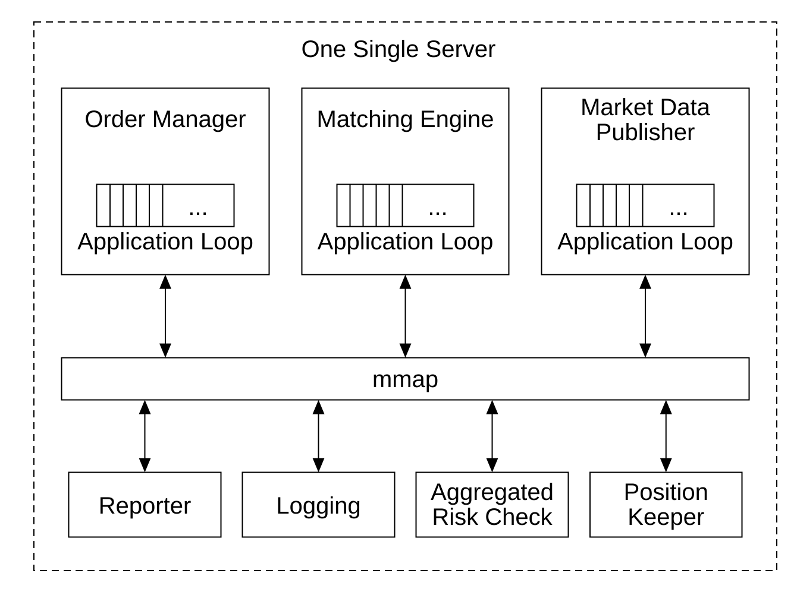
</div>

Another optimization is using an application loop (a while loop executing mission-critical tasks). Each application loop is single-threaded, and the thread is pinned to a fixed CPU core.

Using the order manager as an example, we get the following diagram.

<div style="margin-left:3rem">
    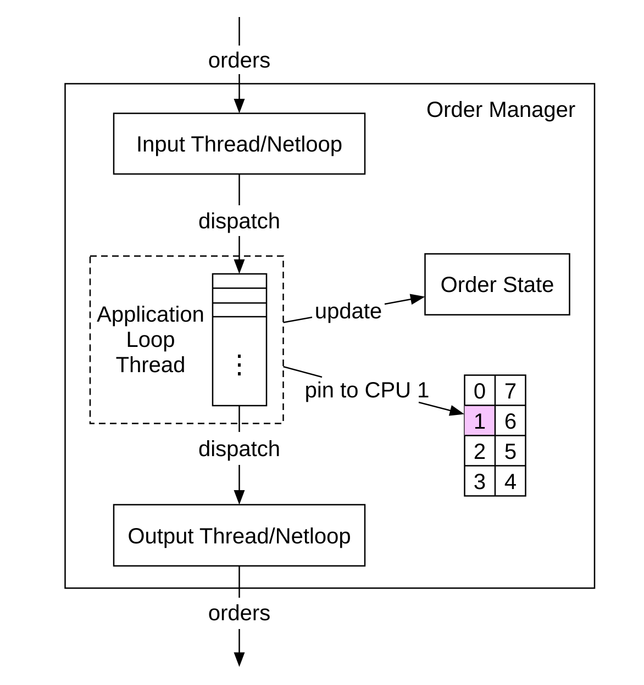
</div>

In this diagram, the application loop for the order manager is pinned to CPU 1. The benefits of pinning the application loop to the CPU are substantial:
1. No context switch [[18]](#ref-18). CPU 1 is fully allocated to the order manager’s application loop.
2. No locks and therefore no lock contention, since there is only one thread that updates states.

Both of these contribute to a low 99th-percentile latency.

Let's now explore how `mmap` works - it is a UNIX syscall, which maps a file on disk to an application's memory.

`mmap` provides a mechanism for high-performance sharing of memory between processes. The performance advantage is compounded when the backing file is in `/dev/shm`. It is a memory-backed file system. When `mmap` is done over a file in `/dev/shm`, the access to the shared memory does not result in any disk access at all.

The communication pathway has no network or disk access, and sending a message on this `mmap` message bus takes less than a microsecond.

### **Event sourcing**

Event sourcing is discussed in depth in the [digital wallet chapter](../27.%20Digital%20Wallet/Readme.md). Reference it for all the details.

In a nutshell, instead of storing current states, we store immutable state transitions:

<div style="margin-left:3rem">
    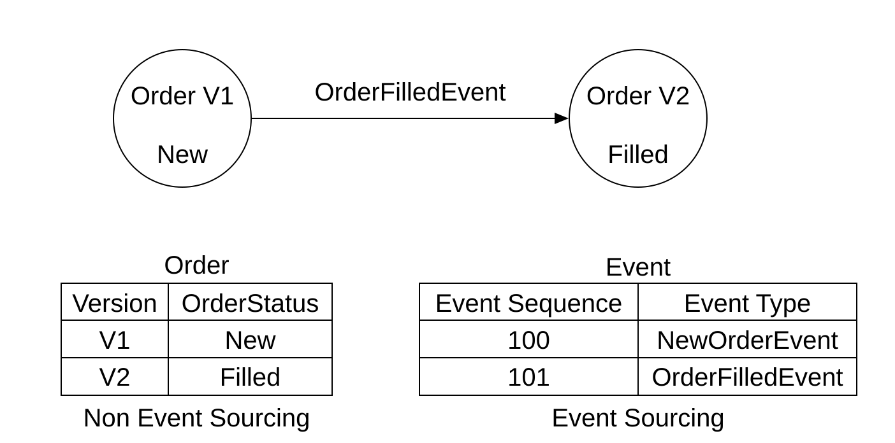
</div>

* On the left - traditional schema
* On the right - event sourcing schema

The image below shows an event sourcing design using the `mmap` event store as a message bus. This looks very much like the Pub-Sub model in Kafka. In fact, if there is no strict latency requirement, Kafka could be used.

<div style="margin-left:3rem">
    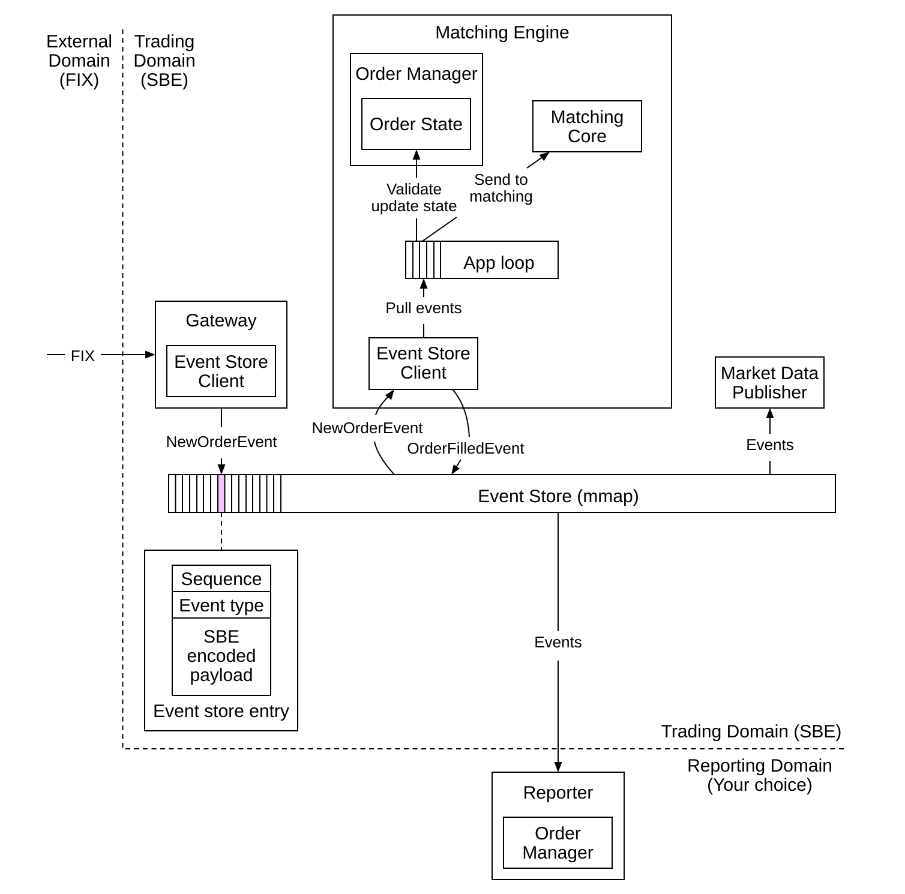
</div>

* The gateway transforms FIX to 'FIX over Simple Binary Encoding' (SBE) for fast and compact encoding and sends each order as a `NewOrderEvent` via Event Store Client in a pre-defined format (see event store entry in the diagram).
* The order manager (embedded in the matching engine) receives the `NewOrderEvent` from the event store, validates it, and adds it to its internal order states. The order is then sent to the matching core.
* If the order gets matched, an `OrderFilledEvent` is generated and sent to the event store.
* Other components such as the market data processor and the reporter subscribe to the event store and process those events accordingly.

There are two optimizations we've done here:
1. The order manager becomes a reusable library embedded in different components. Having a centralized order manager for other components to update or query the order states would hurt latency, especially if those components are not on the critical trading path, as in the case of the reporter in the diagram.
2. The sequencer is nowhere to be seen. With the event sourcing design, we have one single event for all messages. Note that the event store entry contains a "sequence" field. This field is injected by the sequencer. There is only one sequencer for each event store. It is bad practice to have multiple sequencers, as they will fight for the right to write to the event store. We should not waste time on lock contention. Therefore, the sequencer is a single writer which sequences the events before sending them to the event store.

The image below shows a design for the sequencer in a memory-mapped (MMap) environment.

The sequencer pulls events from the ring buffer that is local to each component. For each event, it stamps a sequence ID on the event and sends it to the event store. We can have backup sequencers for high availability in case the primary sequencer goes down.

<div style="margin-left:3rem">
    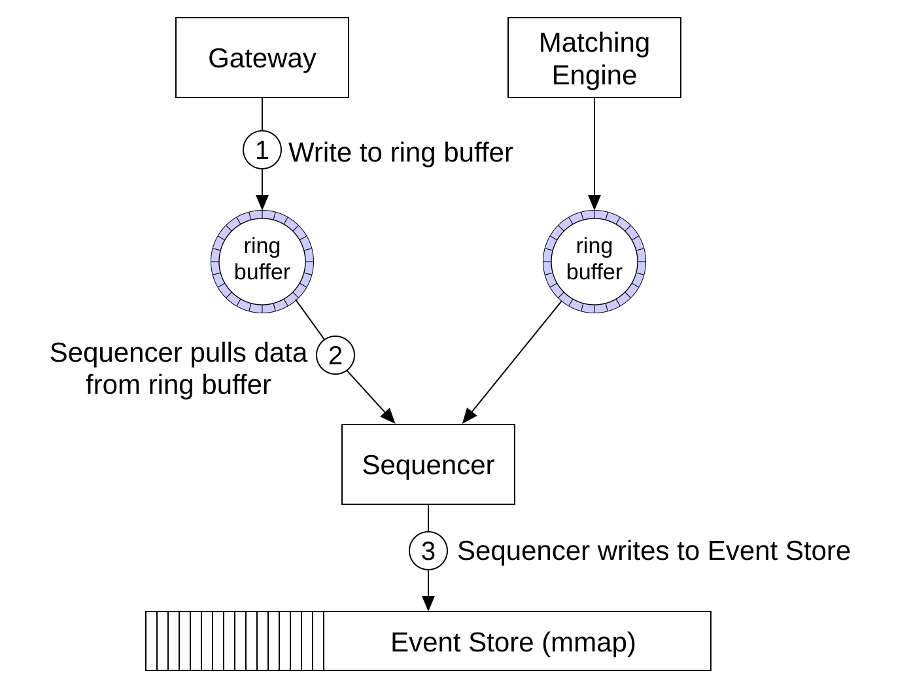
</div>

### **High availability**
We aim for 99.99% availability - only 8.64s of downtime per day.

To achieve that, we have to identify single points of failure in the exchange architecture:
* Set up backup instances of critical services (e.g., the matching engine) that are on standby.
* Aggressively automate failure detection and failover to the backup instance

Stateless services such as the client gateway can easily be horizontally scaled by adding more servers.

For stateful components, we can process inbound events but should not publish outbound events if we're not the leader. In the image below, the hot matching engine works as the primary instance, and the warm engine receives and processes the exact same events, but does not send any event out into the event store.

<div style="margin-left:3rem">
    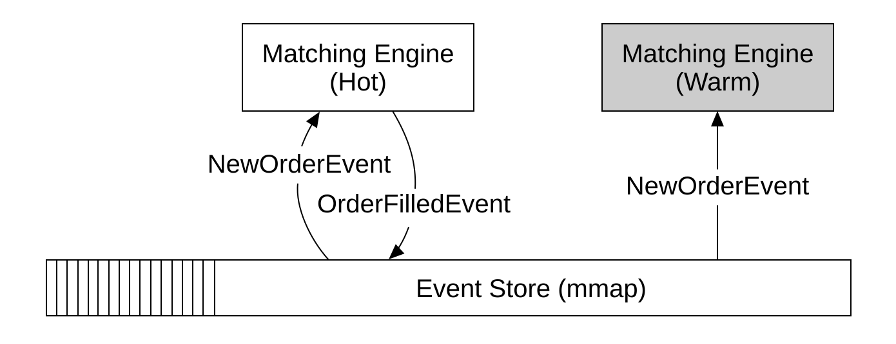
</div>

To detect whether the primary replica is down, we can send heartbeats to detect that it's nonfunctional.

This hot-warm mechanism only works within the boundary of a single server.
If we want to extend it, we can set up an entire server as a hot/warm replica and fail over in case of failure.

To replicate the event store across the replicas, we could use reliable UDP [[19]](#ref-19) to efficiently broadcast the event messages to all warm servers.

### **Fault tolerance**

What if even the warm instances go down? It is a low-probability event, but we should be ready for it.

Large tech companies tackle this problem by replicating core data to data centers in multiple cities to mitigate risks such as natural disasters.

To make the system fault-tolerant, we have to answer many questions:
1. If the primary instance is down, how and when do we fail over to the backup instance?
2. How do we choose the leader among the backup instances?
3. What is the recovery time needed (RTO - Recovery Time Objective)?
4. What functionalities need to be recovered (RPO - Recovery Point Objective)? Can our system operate under degraded conditions?

Let's answer these questions one by one:
* The system can be down due to a bug (affecting the primary and replicas); we can use chaos engineering to surface edge cases and disastrous outcomes like these
* Initially, though, we could perform failovers manually until we gather sufficient knowledge about the system's failure modes
* Leader election can be used (e.g., Raft [[22]](#ref-22)) to determine which replica becomes the leader if the primary goes down.

The example below shows a Raft cluster with five servers with their own event stores. The current leader sends data to all the other instances (followers). The minimum number of votes required to perform an operation in Raft is (N/2 + 1), where N is the number of members in the cluster. In the example, the minimum is 3.

The following diagram shows the followers receiving new events from the leader over RPC. The events are saved to each follower's own mmap event store.

<div style="margin-left:3rem">
    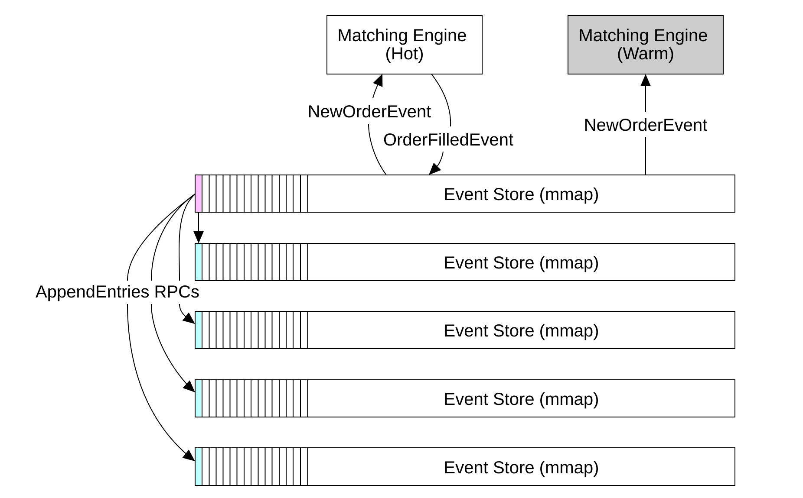
</div>

Let's briefly examine the leader election process. The leader sends heartbeat messages (`AppendEntries` with no content as shown) to its followers. If a follower has not received heartbeat messages for a period of time, it triggers an election timeout that initiates a new election. The first follower that reaches its election timeout becomes a candidate, and it asks the rest of the followers to vote (`RequestVote`). If the first follower receives a majority of votes, it becomes the new leader. If the first follower has a lower term value than the new node, it cannot be the leader. If multiple followers become candidates at the same time, it is called a 'split vote'. In this case, the election times out, and a new election is initiated. See the image below for an explanation of 'term' [[23]](#ref-23). Time is divided into arbitrary intervals in Raft to represent operation and election.

<div style="margin-left:3rem">
    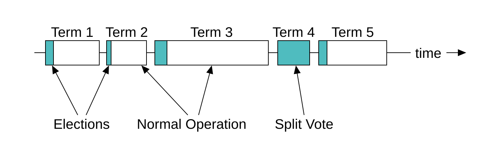
</div>

For details on how Raft works, [check this out](https://thesecretlivesofdata.com/raft/)

Next, let's take a look at recovery time. `Recovery Time Objective (RTO)` refers to the amount of time an application can be down without causing significant damage to the business. For a stock exchange, we need to achieve a second-level RTO, which definitely requires automatic failover of services. To do this, we categorize services based on priority and define a degradation strategy to maintain a minimum service level.

Finally, we need to figure out the tolerance for data loss. `Recovery Point Objective (RPO)` refers to the amount of data that can be lost before significant harm is done to the business, i.e., the tolerance for data loss. For a stock exchange, data loss is not acceptable, so RPO is near zero. With Raft, we have many copies of the data. It guarantees that state consensus is achieved among cluster nodes. If the current leader crashes, the new leader should be able to function immediately.

### **Matching algorithms**

A slight detour on how matching works via pseudocode:

```java
Context handleOrder(OrderBook orderBook, OrderEvent orderEvent) {
    if (orderEvent.getSequenceId() != nextSequence) {
        return Error(OUT_OF_ORDER, nextSequence);
    }

    if (!validateOrder(symbol, price, quantity)) {
        return ERROR(INVALID_ORDER, orderEvent);
    }

    Order order = createOrderFromEvent(orderEvent);
    switch (msgType):
        case NEW:
            return handleNew(orderBook, order);
        case CANCEL:
            return handleCancel(orderBook, order);
        default:
            return ERROR(INVALID_MSG_TYPE, msgType);

}

Context handleNew(OrderBook orderBook, Order order) {
    if (BUY.equals(order.side)) {
        return match(orderBook.sellBook, order);
    } else {
        return match(orderBook.buyBook, order);
    }
}

Context handleCancel(OrderBook orderBook, Order order) {
    if (!orderBook.orderMap.contains(order.orderId)) {
        return ERROR(CANNOT_CANCEL_ALREADY_MATCHED, order);
    }

    removeOrder(order);
    setOrderStatus(order, CANCELED);
    return SUCCESS(CANCEL_SUCCESS, order);
}

Context match(OrderBook book, Order order) {
    Quantity leavesQuantity = order.quantity - order.matchedQuantity;
    Iterator<Order> limitIter = book.limitMap.get(order.price).orders;
    while (limitIter.hasNext() && leavesQuantity > 0) {
        Quantity matched = min(limitIter.next.quantity, order.quantity);
        order.matchedQuantity += matched;
        leavesQuantity = order.quantity - order.matchedQuantity;
        remove(limitIter.next);
        generateMatchedFill();
    }
    return SUCCESS(MATCH_SUCCESS, order);
}
```

This matching algorithm uses the FIFO (First In, First Out) algorithm for determining which orders at a price level to match.

There are many matching algorithms. These algorithms are commonly used in futures trading. For example, FIFO with LMM (Lead Market Maker) algorithms allocate a certain quantity to the LMM based on a predefined ratio ahead of the FIFO queue, which the LMM firm negotiates with the exchange for the privilege. See more matching algorithms on the CME website [[24]](#ref-24). The matching algorithms are used in many other scenarios. A typical one is a dark pool [[25]](#ref-25).

### **Determinism**

Functional determinism is guaranteed via the sequencer technique we used.

The actual time when the event happens doesn't matter:

<div style="margin-left:3rem">
    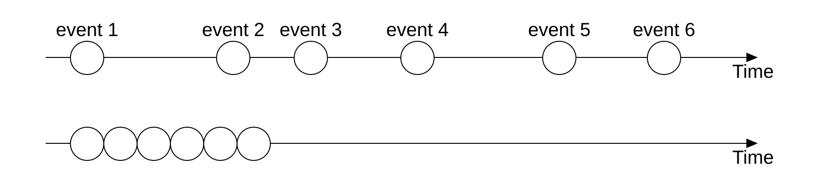
</div>

Latency determinism is something we have to track. We can calculate it by monitoring 99th- or 99.99th-percentile latency.

Things that can cause latency spikes include garbage collector events in, e.g., Java.

### **Market data publisher optimizations**

The **market data publisher (MDP)** receives matched results from the matching engine and rebuilds the order book and candlestick charts based on them.

MDP is a service with many levels. For example, a retail client can only view 5 levels of L2 data by default and needs to pay extra to get 10 levels. MDP's memory cannot expand forever, so we need to have an upper limit on the candlesticks. The design of the MDP is shown below.

<div style="margin-left:3rem">
    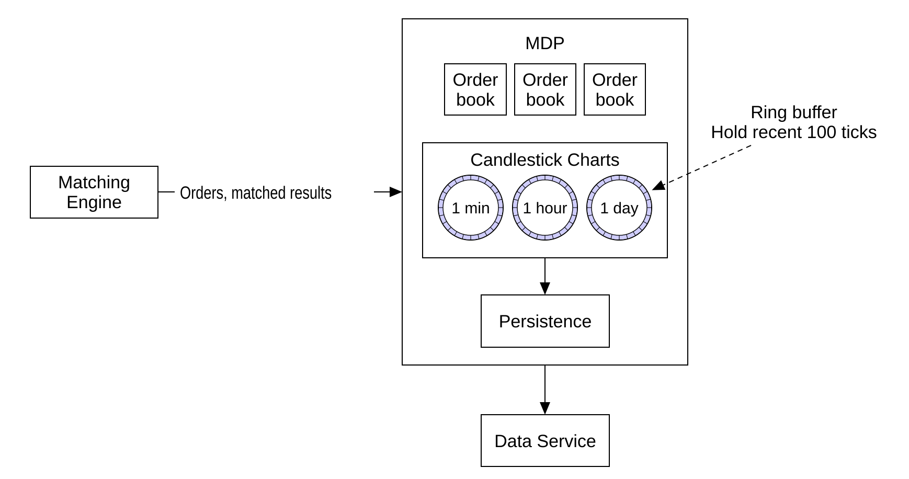
</div>

This design utilizes ring buffers. A ring buffer (aka circular buffer) is a fixed-size queue with the head connected to the tail. The space is preallocated to avoid allocations. The data structure is also lock-free.

Another technique to optimize the ring buffer is padding, which ensures the sequence number is never in a cache line with anything else.

### **Distribution fairness of market data and multicast**

We need to ensure subscribers receive the data at the same time since if one receives data before another, that gives them crucial market insight, which they can use to manipulate the market.

To achieve this, we can use multicast using reliable UDP when publishing data to subscribers.

Data can be transported via the internet in three ways:
* Unicast - one source, one destination
* Broadcast - one source to an entire subnetwork
* Multicast - one source to a set of hosts on different subnetworks

Multicast is a commonly used protocol in exchange design. With several receivers configured in the same multicast group, they will in theory receive data at the same time. However, UDP is an unreliable protocol and the datagram might not reach all the receivers. There are solutions to handle retransmission [[29]](#ref-29).

### **Colocation**

Exchanges offer brokers the ability to colocate their servers in the same data center as the exchange.

This reduces the latency drastically and can be considered a VIP service.

### **Network Security**

DDoS is a challenge for exchanges, as there are some internet-facing services. Here are our options:
1. Isolate public services and data from private services, so DDoS attacks don't impact the most important clients.
2. Use a caching layer to store data which is infrequently updated
3. Harden URLs against DDoS; e.g., prefer `https://my.website.com/data/recent` over `https://my.website.com/data?from=123&to=456` because the former is more cacheable.
4. An effective allowlist/blocklist mechanism is needed.
5. Rate limiting can be used to mitigate DDoS.

## Step 4: Wrap Up

Other interesting notes:
* Not all exchanges rely on putting everything on one big server, but some still do.
* Modern exchanges rely more on cloud infrastructure and also on automatic market makers (AMM) to avoid maintaining an order book.

## Reference materials

1. <a id="ref-1"></a>[LMAX exchange was famous for its open-source Disruptor](https://www.lmax.com/exchange)
2. <a id="ref-2"></a>[IEX attracts investors by “playing fair” and is also the “Flash Boys Exchange”](https://en.wikipedia.org/wiki/IEX)
3. <a id="ref-3"></a>[NYSE matched volume](https://www.nyse.com/markets/us-equity-volumes)
4. <a id="ref-4"></a>[HKEX Securities Statistics Archive](https://www.hkex.com.hk/Market-Data/Statistics/Consolidated-Reports/Securities-Statistics-Archive?sc_lang=en)
5. <a id="ref-5"></a>[All of the World’s Stock Exchanges by Size](http://money.visualcapitalist.com/all-of-the-worlds-stock-exchanges-by-size/)
6. <a id="ref-6"></a>[Denial of service attack](https://en.wikipedia.org/wiki/Denial-of-service_attack)
7. <a id="ref-7"></a>[Market impact](https://en.wikipedia.org/wiki/Market_impact)
8. <a id="ref-8"></a>[Fix trading](https://www.fixtrading.org/)
9. <a id="ref-9"></a>[Event Sourcing](https://martinfowler.com/eaaDev/EventSourcing.html)
10. <a id="ref-10"></a>[CME Co-Location and Data Center Services](https://www.cmegroup.com/trading/colocation/co-location-services.html)
11. <a id="ref-11"></a>[Epoch and Unix timestamp converter](https://www.epochconverter.com/)
12. <a id="ref-12"></a>[Order book — Investopedia definition](https://www.investopedia.com/terms/o/order-book.asp)
13. <a id="ref-13"></a>[Order book — Wikipedia overview](https://en.wikipedia.org/wiki/Order_book)
14. <a id="ref-14"></a>[How to Build a Fast Limit Order Book](https://bit.ly/3ngMtEO)
15. <a id="ref-15"></a>[Developing with kdb+ and the q language](https://code.kx.com/q/)
16. <a id="ref-16"></a>[Latency Numbers Every Programmer Should Know](https://gist.github.com/jboner/2841832)
17. <a id="ref-17"></a>[mmap](https://en.wikipedia.org/wiki/Memory_map)
18. <a id="ref-18"></a>[Context switch](https://bit.ly/3pva7A6)
19. <a id="ref-19"></a>[Reliable User Datagram Protocol](https://en.wikipedia.org/wiki/Reliable_User_Datagram_Protocol)
20. <a id="ref-20"></a>[Aeron](https://github.com/real-logic/aeron/wiki/Design-Overview)
21. <a id="ref-21"></a>[Chaos engineering](https://en.wikipedia.org/wiki/Chaos_engineering)
22. <a id="ref-22"></a>[Raft](https://raft.github.io/)
23. <a id="ref-23"></a>[Designing for Understandability: the Raft Consensus Algorithm](https://raft.github.io/slides/uiuc2016.pdf)
24. <a id="ref-24"></a>[Supported Matching Algorithms](https://bit.ly/3aYoCEo)
25. <a id="ref-25"></a>[Dark pool](https://www.investopedia.com/terms/d/dark-pool.asp)
26. <a id="ref-26"></a>[HdrHistogram: A High Dynamic Range Histogram](http://hdrhistogram.org/)
27. <a id="ref-27"></a>[HotSpot (virtual machine)](https://en.wikipedia.org/wiki/HotSpot_(virtual_machine))
28. <a id="ref-28"></a>[Cache line padding](https://bit.ly/3lZTFWz)
29. <a id="ref-29"></a>[NACK-Oriented Reliable Multicast](https://en.wikipedia.org/wiki/NACK-Oriented_Reliable_Multicast)
30. <a id="ref-30"></a>[AWS Coinbase Case Study](https://aws.amazon.com/solutions/case-studies/coinbase/)
